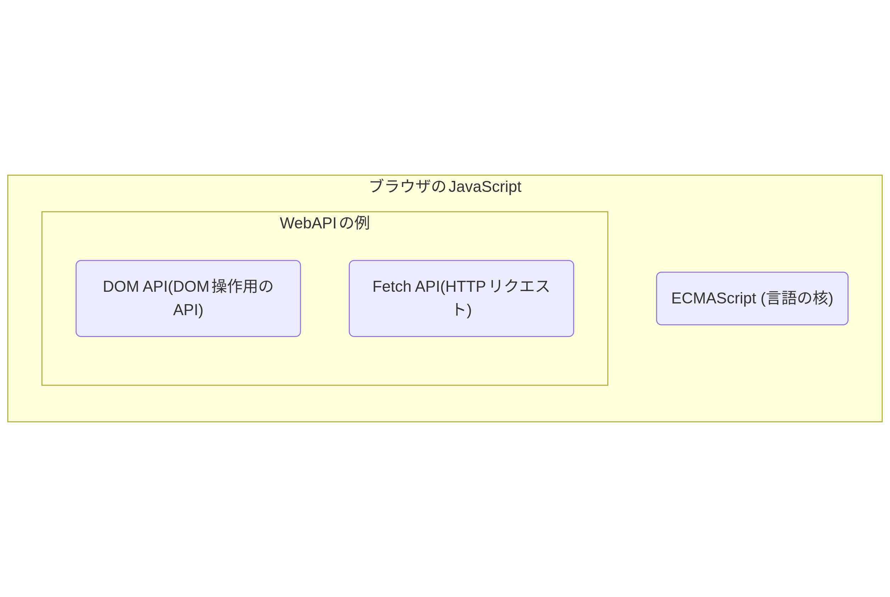

# JavaScript

JavaScript(ジャバスクリプト)とはプログラミング言語の1つで、とくにWebページに機能を追加できるスクリプト言語です。
JavaScriptは1995年にNetscape NavigatorというWebブラウザ上で動くように開発されました。
当初は別の名前でしたが、その当時から人気だったプログラミング言語Javaにあやかって「JavaScript」と名付けられました。
そのためJavaScriptはJavaと名前が似ていますが、名前以上の共通点はなく、メロンとメロンパンのような関係です。

HTML/CSSはWebページの構造や見た目を定義するための言語ですが、 なにかのデータを取得したり、ユーザーの操作に応じてページの内容を切り替えるほどの機能はありません。
JavaScriptを使うとWebページに動的な機能を追加することができ、例えば次のようなことができます。
- ユーザーの操作に応じてページの内容を変更する
- 一定時間ごとにページの内容を更新する
  - 本文を変更する
  - データローディング中のアニメーションを表示して、ロードが完了したら画像に切り替えるなど
- ユーザーの入力を検証する
- アニメーションを追加する
- 外部のサービスからデータを取得して表示する

JavaScriptはもともとWebブラウザ上で動作するスクリプト言語として開発されましたが、現在ではサーバーサイドでも広く使われています。

# ブラウザで動くJavaScript

JavaScriptはブラウザで動作するプログラミング言語ですが、実はブラウザのJavaScriptは大きく2つの構成要素で成立しています。

1つがJavaScriptの基本的な仕様であるECMAScript、もう1つがDOMの操作などを含んだ Web APIです。

## ECMAScript

ECMAScriptとはJavaScriptの別名であり、JavaScriptの仕様の名前として今は使われています。
ECMAScriptで定義されているものは次のような言語のコアとなる仕様です。

- 言語の文法
- 型
- 様々なビルトインの関数、オブジェクト
- ...

## WEB API

# JavaScriptの歴史

JavaScriptを学ぶ前に、 JavaScriptがどういった歴史を辿っている言語なのか見てみましょう。

## 第1章：誕生と長い沈黙 (1997年～2009年)

### 始まりは「ブラウザ戦争」の仲裁

JavaScriptはブラウザで動作する言語ですが、最初はNetscape社のブラウザ専用で開発されていました。(今のFireFoxの元になっているブラウザです)
1996年にはMicrosoftがInternet Explorer 3.0をリリースしました。
IE3には「JScript」というJavaScriptに似た言語が実装されていましたが、微妙にNetscapeのJavaScriptとは異なる挙動をしました。
そのため開発者はどちらのブラウザでも動くコードを書くのに苦労していました。
この混乱を収めるため、国際的な標準化団体である**Ecma International**が乗り出し、1997年に仕様の初版の「**ECMAScript 1 (ES1)**」を発行しました。
JavaScript1ではないのは、前述の通り当時はJavaScriptはNetscapeで動く言語のことを指していたので、別名で管理されたという歴史的経緯によるものです。

-   **ES1 (1997年)**: JavaScriptの基本的な骨格がここで固まりました。
-   **ES3 (1999年)**: `try...catch`（エラー処理）や正規表現など、今でも使われる重要な機能が追加されました。

しかし、この後が大変でした。次のバージョンである**ES4**は、クラス構文など野心的な機能を詰め込みすぎてしまい、関係者の意見がまとまらず、**計画は破棄**されてしまいました。

この結果、ES3から次のバージョンが出るまで**約10年間**、ECMAScriptは大きな進化を止め、「**冬の時代**」と呼ばれました。

---

## 第2章：再始動の一歩「ES5」 (2009年)

ES4の失敗を教訓に、より現実的で着実な改善を目指してリリースされたのが「**ECMAScript 5 (ES5)**」です。これは、JavaScriptの歴史における静かな、しかし重要な一歩でした。

### ES5の主な功績

-   **`'use strict'` (厳格モード):** コードの最初にこれを書くことで、曖昧で間違いやすい書き方をエラーとしてくれるようになりました。コードの安全性が向上しました。
-   **配列用の便利なメソッド追加:** `forEach`, `map`, `filter` などが追加され、ループ処理がよりスマートに書けるようになりました。
-   **JSONサポート:** `JSON.parse()` や `JSON.stringify()` が標準機能となり、サーバーとのデータ通信が簡単になりました。

ES5は、jQueryなどのライブラリが提供していた便利な機能の一部を、言語の標準機能として取り込み始めたバージョンと言えます。

---

## 第3章：革命の「ES2015 (ES6)」 (2015年)

JavaScriptの歴史は、このバージョンによって完全に変わりました。10年分の進化が一気に訪れたような、**最大かつ最も重要なアップデート**です。これ以降、ECMAScriptは「ES＋発行年」で呼ばれるようになります。

### ES2015がもたらした革命的な新機能

-   **`let` / `const`:** これまでの `var` が抱えていた問題を解決する、新しい変数宣言の方法です。意図しない変数の書き換えなどを防ぎます。
-   **アロー関数 (`=>`):** 関数を短く、より直感的に書けるようになりました。特に `this` の扱いがシンプルになり、多くの開発者を混乱から救いました。
-   **クラス (`class`):** 他のプログラミング言語のように、`class` というキーワードを使ってオブジェクトの設計図を綺麗に書けるようになりました。
-   **モジュール (`import` / `export`):** コードをファイル単位で分割し、必要な機能だけを読み込んで使えるようになりました。大規模な開発には必須の機能です。
-   **Promise:** 非同期処理（時間がかかる処理）で発生しがちだった「コールバック地獄」を解決し、コードを読みやすくするための仕組みです。

ES2015の登場により、JavaScriptは本格的で大規模なアプリケーションを開発するための、モダンなプログラミング言語へと生まれ変わりました。

---

## 第4章：毎年の小さな進化へ (2016年～現在)

ES2015という大きな革命の後、ECMAScriptは方針を変えました。**「大きな変更を10年待つのではなく、小さな改善を毎年積み重ねていこう」**という方針です。

これにより、開発者は毎年少しずつ新しい便利な機能を学び、着実に言語の進化についていくことができるようになりました。

### 近年の代表的な機能

-   **ES2016:** 配列に特定の要素が含まれるか調べる `includes()` など。
-   **ES2017:** Promiseをさらに分かりやすく書ける `async/await` が登場。非同期処理の書き方の決定版として広く使われています。
-   **ES2020:** `?.` (オプショナルチェイニング) が登場。`null` や `undefined` によるエラーをスマートに回避できるようになりました。

# JavaScriptとブラウザの対応
では最新のJavaScriptの仕様でプログラミングが出来るかと言うと、実は5年ほど前まではこのあたりに気を配る必要が有りました。

というのもJavaScriptはWebブラウザで動作しますが、PCでのChromeやFireFoxなどの日々更新プログラムが配布されて変化していくブラウザだけではなかったのです。
特に有名なのがWindowsで一斉を風靡したInternet Explorerです。
IEはWindowsの新バージョンのリリース時などにしか更新されず、またIEは標準化されたWeb APIが出来る前からあるAPIを使わないといけないなどの互換性の上で問題がありました。

この互換性の問題が極めて大変だったので、JavaScriptのプログラマは「新しい仕様のJavaScriptを古い仕様でも動くように変換する」や「動いているブラウザを判別して自動で使うAPIを切り替える」などを自動的に行うツールを開発、利用してきました。

とはいえIEは2022年にサポートが終了し、2023年以降はEdgeが変わりに開くようになっているため、現代ではIEの考慮をしなくてよくなりました。
現代ではおおよそ大体のブラウザがES6に対応しているため、これからJavaScriptを学ぶ際はES6以降の文法をデフォルトとして考えてもよい、となっています。

しかし古いブラウザ問題は依然として存在しており、現代では特にiPhoneのiOS, iPadOSなどで使われているSafariが対応していないAPIなどがそこそこ存在してきてはいます。
別のブラウザやスマートフォンで書いたコードが動かないとなったら、[caniuse](https://caniuse.com/)などで使っているAPIが対応しているブラウザか確認すると良いでしょう。

# AltJS

2025年の現代でこそ生のJavaScriptの表現力はだいぶ向上しましたが、特に2008年あたりの時代ではJavaScriptの言語仕様の進化が停滞し、プログラマの期待に沿うような開発がやりずらい状態が発生しました。

そこでモダンな文法や書きやすい機能を実装した別の言語でプログラミングをし、それをJavaScriptのソースコードに変換するという手法が台頭しました。
このようにあるプログラミング言語のソースコードを別のプログラミング言語のソースコードに変換することを一般的に「**トランスパイル**」、と言い、特にJavaScriptの代替となるようなプログラミング言語のことをAlternative JavaScript、通称**AltJS**と呼ぶようになりました。


TypeScriptの入門書などを読んでいると、TypeScriptからJavaScritpに変換するトランスパイルのことを「**コンパイル**」と読んでいる書籍もあります。
狭義のコンパイルとはCやJava、Goなどのソースコードを機械語やそれに近いバイトコードなどの低水準言語(機械に近い言語)に変換することを指します。
コンパイルの結果生成されたものは通常人間が読むことを想定しておらず、機械向けに作られています。

広義のコンパイルはこのような「あるソースコードをあるものに変換する」をすべて包括した概念として使われることがあります。
つまりトランスパイルもコンパイルの一種と言えます。
そのため「TypeScriptをJavaScriptにコンパイルする」という表現があっても同じことを意味しています。


代表的なAltJSには次のようなものがあります。(いっぱいありますね)

- CoffeeScript
  - かつてRuby on Rails方面でよく使われた
  - 現在は2年ほど開発が止まっている...
- TypeScript
  - 今回のトピック
- Scala.js
  - Scalaというプログラミング言語をJavaScriptに変換する
- PureScript
- Elm
- Gleam
  - [関数型まつりでGleamについて話しました](https://zenn.dev/comamoca/articles/2025-06-17-i-was-talk-about-gleam-at-fpmatsuri)
  - [TypeScriptユーザーに贈るGleam入門](https://zenn.dev/comamoca/articles/gleam-tour-for-typescript-user)
- ClojureScript

JavaScript界隈は進化が激しい世界なので、2~3年前の情報ですらだいぶ古いという状態になります。
特にAltJSに関しては現在では開発が止まっているもの、現代のJavaScriptよりも表現力が落ちているものなどが存在するため、技術選択をする際は最近の動向をチェックするようにしましょう。

# jQuery

Webフロントエンドで昔からよく聞くライブラリにjQueryがあります。
jQueryは2006年にリリースされて以降現在でも広く使われています。

jQueryは当時のJavaScriptが抱えていた次のような課題に対して作られました。
- ブラウザごとの互換性が低い
- JavaScript自体の機能が弱い

jQueryはJavaScriptのAPIを抽象化し、ブラウザごとの差異を吸収することで、同じコードでどのブラウザでも動作するようにしました。
jQueryは非常に多くの機能を提供しており、特にDOM操作やイベント処理、Ajax通信などを簡単に行うことができるようになっています。
しかし、現在ではブラウザ間の差異がほとんどなくなったこと、 JavaScript自体の言語仕様が大きく改善されたことから、jQueryを使わずとも同じようなことができるようになりました。
そのため、現在ではjQueryを使うことは少なくなっています。
とはいえ便利なライブラリであることは変わりないので、比較的長く運用されているサイトや枯れた技術スタックを採用している場合はjQueryが使われていることもあります。

jQueryそのものはTypeScriptの型定義も提供されており、TypeScriptからも利用することができます。
いまからjQueryを使うぞ!!という場合もTypeScriptで書くのがおすすめです。

# 必ずフロントエンドではJavaScriptを書かないといけないのか

フロントエンドでは必ずJavaScript/TypeScriptを使わないといけないかというと、そんなことはありません。
実際いくつかJavaScriptを書かずともリッチなフロントエンドが実装できるライブラリが存在します。
- Hotwire
    - 主にRuby on RailsというWebアプリケーションフレームワークで利用されます
- htmx
    - HTMLのようなシンタックスでJavaScriptのような動きを抑制できます
- Alpine.js
    - htmxと同じようにhtmlを若干拡張したような構文でモダンなフロントエンドを作れます

またWebAssemblyという技術も台頭しています。これは、CやRust, Rubyなどで書いたコードをバイナリに変換しそれをブラウザが解釈するというものです。
最終的にはブラウザが解釈することもあり、JavaScriptを書かなくてもDOM操作ができます。

他にはアニメーションのようなものであればHTML/CSSで十分表現可能である場合もあります。
とはいえこれらはあくまでもJavaScriptを使って実装されたものや使用するAPIがJavaScriptと同じものがほとんどです。
そのためJavaScriptを学んでおけばJavaScriptができること、できないことを把握しておくとこれらのライブラリが裏側で何をやってるか、ブラウザ出来ること/出来ないことがなんとなくわかるので学習としてはJSを学んで損はないのではないか、というところです。
