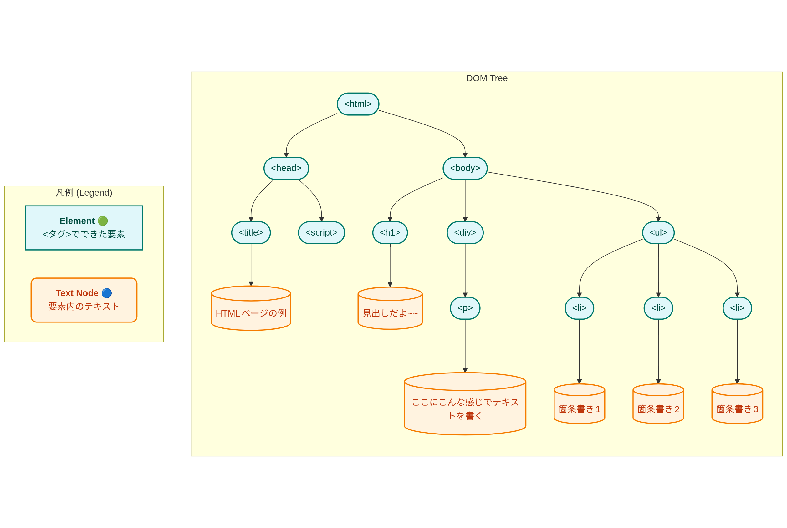

# DOM入門

ここでちょっとブラウザの世界に戻ってきましょう。

ブラウザがHTMLを表示する際、ブラウザはHTMLを読み込んだあとにどのようにページとして表示しているのでしょうか。
ブラウザはHTMLを読み込むと、その要素をDOM(Document Object Model)と呼ばれるデータ構造に変換します。

例えば次のようなHTMLはDOMとして解釈されると図のような構造になります。

```html
<html>
    <head>
        <title>HTMLページの例</title>
        <script src="./script.js"></script>
    </head>
    <body>
        <h1>見出しだよ~~</h1>
        <div>
            <p>ここにこんな感じでテキストを書く</p>
        </div>
        <ul>
            <li>箇条書き1</li>
            <li>箇条書き2</li>
            <li>箇条書き3</li>
        </ul>
    </body>
</html>
```



この構造は一番上が`<html>`タグで、そこから`<head>`と`<body>`に枝が別れています。
このようなある一点から開始し、枝分かれしていく構造のことを、木を逆さまにしたような構造に見えることから「木構造」と言います。

ブラウザは実際はHTMLの内容をそのまま表示しているのではなく、内部的に変換したDOMに基づいて表示を行っています。
DOM上では各タグのことを「Element(エレメント)」と呼び、各エレメントの中の文字などの要素を「Node」と呼びます。
上のHTMLでは各文章の内容などがNodeとして管理され、タグ自体はElementとして管理されます。

# JavaScriptとDOM

JavaScriptはブラウザで動くことからなんとなく想像できるかもしれませんが、DOMを操作することが可能です。
(ただし標準でDOMが操作できるのはあくまでもブラウザ上のJavaScriptで、Node.jsの場合はライブラリのインストールが必要)

```html
<html lang="ja">
    <head>
        <title>サンプルページです</title>
    </head>
    <body>
        <h1>みだしだよ〜〜</h1>
        <script>
            const hello = document.createElement('p');
            hello.textContent = 'JavaScriptで追加したよ〜〜';
            document.body.appendChild(hello);
        </script>
    </body>
</html>
```

上のhtmlを保存して表示すると、HTMLとしては書いていないはずの`<p`>タグと文章が管理者ツールから見ると表示されています。
これはJavaScript実行時にDOMを操作して、`<p>`タグのElementをBodyの末尾に挿入したということです。

# idを使ったDOM操作

DOMを操作する際、特定の要素を指定して操作したいことが多いです。
HTMLでは`id`属性を使うことで、特定の要素を一意に識別することができます。
JavaScriptでは`document.getElementById()`を使うことで、特定の`id`を持つ要素を取得することができます。

次のhtmlを`yamanashi-manga.html`として保存して、ブラウザで開いてみてください。


````
<!DOCTYPE html>
<html lang="ja">
<head>
    <meta charset="UTF-8">
    <meta name="viewport" content="width=device-width, initial-scale=1.0">
    <title>Document</title>
</head>
<body>
     <h1 id="topic">山梨県舞台の漫画</h1>
    <ol id="manga-list">
        <li>mono</li>
        <li>ゆるキャン△</li>
    </ol>
</body>
</html>
````

まずはブラウザの管理者ツールを開いて、コンソールを表示してください。
JavaScriptのコードをコンソールに入力して、DOMを操作してみましょう。

まずはbodyのElementを取得してみましょう。

```js
document.body;
```


`<h1>`タグの内容をJavaScriptで取得してみましょう。

ブラウザの管理者ツールで次のコードを実行してみてください。

```js
document.getElementById('topic');
```

このコードは`<h1>`タグのElementを取得するコードです。
取得したElementは、ブラウザの管理者ツールのコンソールに表示されます。
次に、取得したElementの内容を変更してみましょう。

```js
const topicElement = document.getElementById('topic');
topicElement.textContent = '山梨県舞台の漫画とアニメ';
```

このコードは、取得した`<h1>`タグの内容を変更するコードです。
これを実行すると、ブラウザ上の`<h1>`タグの内容が変更されます。
次に、`<ol>`タグの内容をJavaScriptで取得してみましょう。

```js
const mangaListElement = document.getElementById('manga-list');
```
このコードは`<ol>`タグのElementを取得するコードです。
取得したElementの内容を変更してみましょう。

```js
mangaListElement.innerHTML = '<li>mono</li><li>ゆるキャン△</li><li>スーパーカブ</li>';
```
このコードは、取得した`<ol>`タグの内容のHTMLを直接変更するコードです。
これを実行すると、ブラウザ上の`<ol>`タグの内容が変更されます。

次はDom objectを使って、要素を追加してみましょう。

```js
const newMangaItem = document.createElement('li');
newMangaItem.textContent = 'ミソニノミコト';
mangaListElement.appendChild(newMangaItem);
```
このコードは、`<li>`タグのElementを新しく作成し、その内容を「ミソニノミコト」に設定してから、既存の`<ol>`タグの末尾に追加するコードです。
これを実行すると、ブラウザ上の`<ol>`タグの末尾に「ミソニノミコト」が追加されます。


## 練習問題
作家リストの下にolタグを追加して、山梨県の市町村を3つ追加してみましょう。

- 甲府市
- 北杜市
- 南アルプス市
...

ヒント: bodyの要素は大きいため、要素をすべてinnerHTMLで書くよりは、appendChildでDOMを追加するのがわかりやすいでしょう
