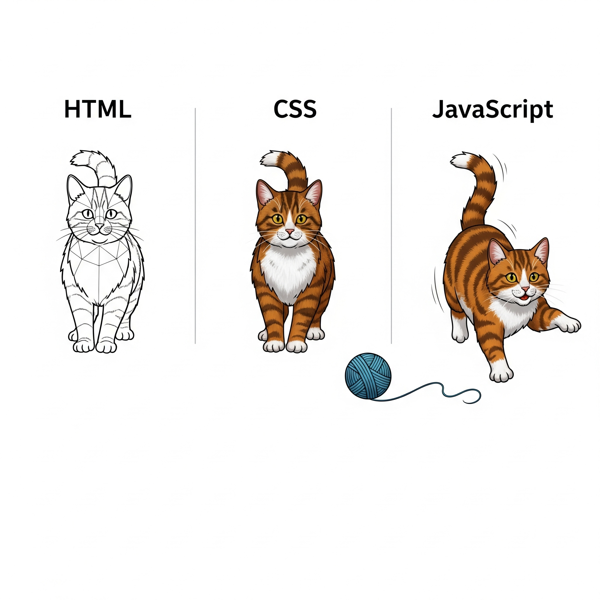

# ウェブ/インターネット入門

「ネットは広大だわ」で知られているインターネットですが、一旦プログラミングをする前にここについておさらいしましょう。

---

## インターネットって何？

**インターネット**は、私たちがWebを利用する上で最も根底にある技術です。例えるなら、**世界中のコンピューターをつなぐ巨大な道路網**のようなもの。この道路網があるおかげで、世界中のコンピューターがお互いに情報をやり取りできるようになっています。

### プロトコル

インターネット上のコンピューターは、どのように情報をやり取りしているのでしょうか？それは、**TCP/IP**という「共通のルール（プロトコル）」を使うことで実現しています。これは、コンピューター同士がメッセージをやり取りするための「お約束」のようなものです。このルールがあるからこそ、異なる種類のコンピューターでもスムーズに通信できます。

プロトコルというとやや敷居が高く感じられますが、「山」と言ったら「川」と返す、日本語で「おはよう」と言ったら英語ではなくて日本語で「おはよう」と返す、のようなコミュニケーション上のルールに相当します。

---

## ウェブ（Web）って何？

**ウェブ**（正式名称は「ワールドワイドウェブ：World Wide Web」）は、インターネットという巨大な道路網の上で提供されている、数あるサービスの一つです。

例えるなら、**インターネットという道路網の上を走る「特定の配送サービス」**のようなものです。このサービスでは、**ハイパーリンク**という仕組みを使って、テキスト、画像、動画といった様々な情報がまるでクモの巣（Web）のように張り巡らされています。私たちが普段「インターネットを見る」と言っているのは、ほとんどの場合、このウェブサービスを利用してウェブサイトを閲覧している状態を指します。

ウェブは、後述する**HTTP**というルール（交通ルール）に従って、**HTML**という形式（荷物の設計図）で情報を提供しています。

### HTTPとHTML

* **HTTP（Hypertext Transfer Protocol）**: ウェブ上で情報がやり取りされる際の「**ルール**」や「**共通言語**」です。
このルールのことをプロトコルと言います。
ウェブブラウザでサイトを見る時、ブラウザはこのHTTPを使って、ウェブサイトの情報を保管しているサーバーに「このページを見せてください」と要求し、サーバーはその情報（HTMLなど）を返します。この一連の流れがHTTPによって行われます。

* **HTML（Hypertext Markup Language）**: ウェブページを作成するための「**言語**」です。ウェブページに表示される文字、画像、リンクなどが、どこに、どのように配置されるか、といったことを記述するための設計図のようなものです。ウェブブラウザは、このHTMLの記述を読み取って、私たちが普段目にしているような美しいウェブページを画面に表示してくれます。

* **CSS (Cascading Style Sheets)**: HTMLはウェブページの骨格を示す設計図ですが、HTMLだけだとモノクロのシンプルなページになってしまいます。現代的なWebサイトには必須の見た目の表示はCSSによって制御します。

* **JavaScript**: 今日の本題のプログラミング言語です。 JavaScriptがあることで画面に動きが生まれます。

### 実際にCSS/JSを無効化してみて体験がどう変わるか見てみましょう

#### JavaScriptの無効化

まずはJavaScriptの効果を確認するために無効化してみましょう。
1. Chromeの開発者ツールを開きます。
    - Windows/Linux: `Ctrl + Shift + I`
    - macOS: `Cmd + Option + I`
2. 開発者ツールの「Console」タブを選択します。
3.  右上の3つの点をクリックして「コマンドを実行」を選択します。
4. `javascript`と入力して「Disable JavaScript/JavaScriptを無効にする」を選択します。

#### CSSの無効化
次にCSSの効果を確認するために無効化してみましょう。

1. Chromeの開発者ツールを開きます。
   - Windows/Linux: `Ctrl + Shift + I`
   - macOS: `Cmd + Option + I`
1. 開発者ツールの「Elements」タブを選択します。
1. Stylesのセクションで、CSSのスタイルを無効化します。
1. Elementsの中から`<link ref="stylesheet" ...`の行を見つけて、右クリックして「Disable」または「Delete」を選択します。
   - 検索すると見つけやすいです
     - Windows: `Ctrl + F`
     - macOS: `Cmd + F`

すると、ウェブページのスタイルがなくなり、テキストだけのシンプルな表示になります。

---

## ここまでのまとめ

* **インターネット**: 世界中のコンピューターをつなぐ巨大なネットワーク（道路網）。
* **ウェブ**: インターネット上で提供されている、ハイパーリンクでつながった情報システム（特定の配送サービス）。
* **HTTP**: ウェブ上で情報がやり取りされる際のルール（交通ルール）。
* **HTML**: ウェブページの構造や内容を記述するための言語（荷物の設計図）。

これらが連携することで、私たちは世界中の情報を簡単に閲覧したり、共有したりできるのです。

