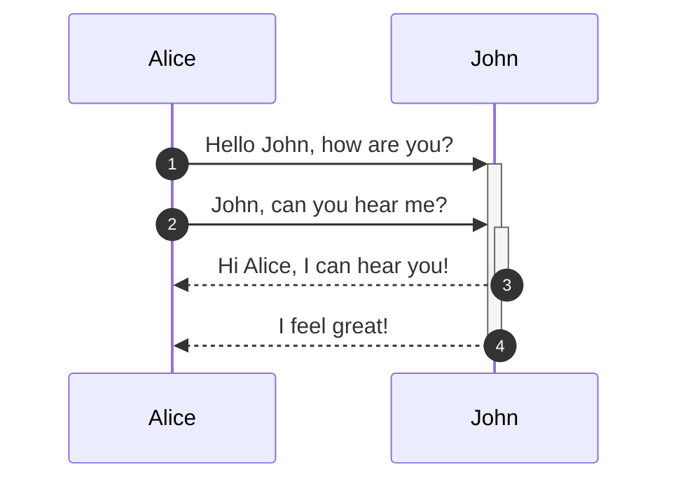
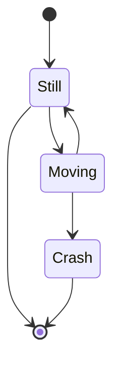

# プログラミング

> プログラム【program】
> 読み方：ぷろぐらむ
> 
> ［名］(スル)
> 
> 1. ある物事の進行状態についての計画や予定。予定表。「新人教育の—」
> 1. 演劇・映画・音楽会・テレビなどの演目・曲目・番組。また、出演者の紹介、解説などを印刷した小冊子や番組表。「雨天により—が一部変更された」
> 1. コンピューターへ指示する、計算や仕事の手順を特定の言語や形式で書いたもの。また、それを作ること。
> デジタル大辞泉 
> https://www.weblio.jp/content/%E3%83%97%E3%83%AD%E3%82%B0%E3%83%A9%E3%83%A0

